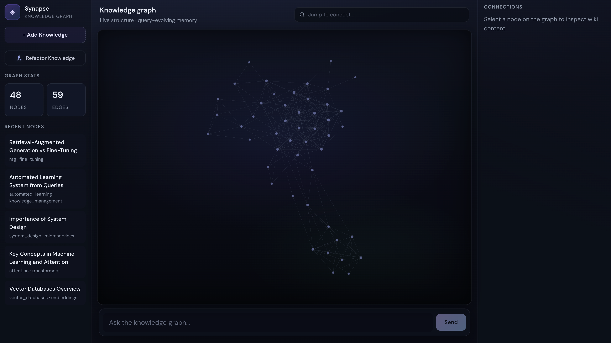
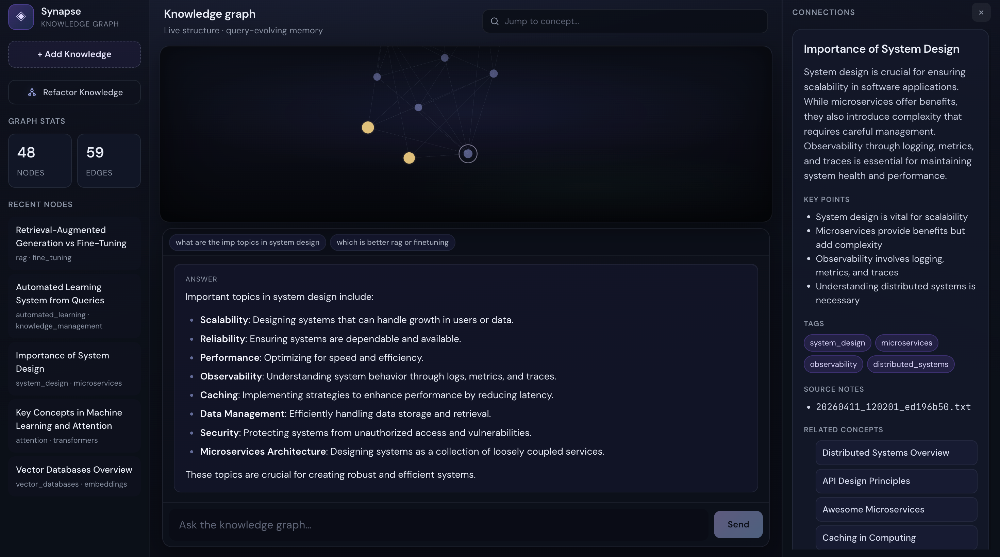
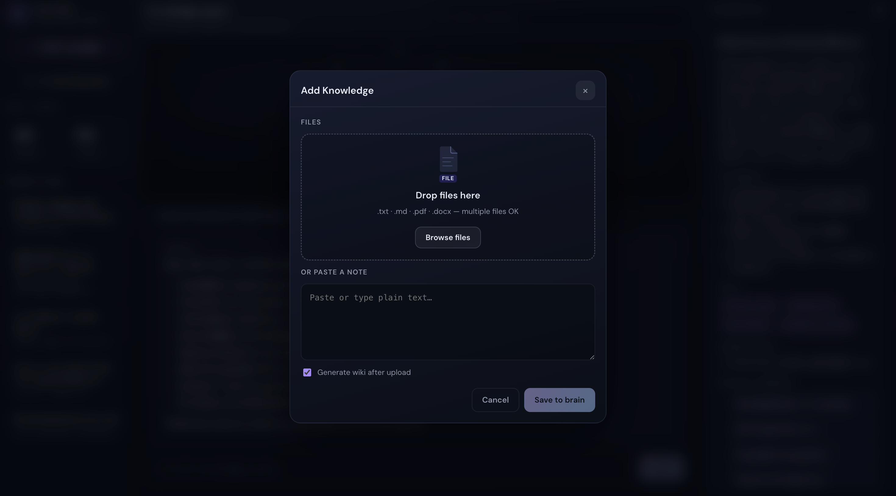
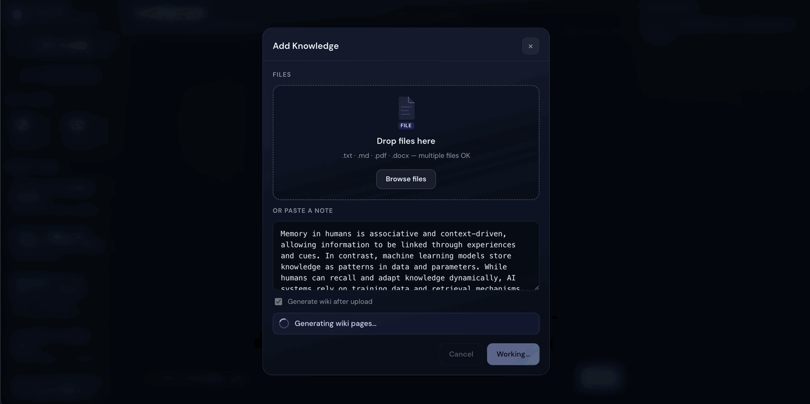

# Synapse


**A self-evolving knowledge system that transforms raw data into a structured, continuously improving knowledge graph.**

Synapse is not a chatbot. It is a system that learns, restructures, and improves its own knowledge over time.

## Why this matters

Most production AI systems **answer**; they do not **evolve** an owned knowledge artifact. Synapse is built so the wiki and graph can improve with use—write-back, refactor, and schema-bound pages—so tomorrow’s retrieval runs on structure that changed on purpose, not only on new chat logs.

That is an intentional move from **stateless retrieval** (pull chunks, answer, move on) toward **persistent intelligence**: inspectable JSON, provenance, refactors, and a corpus that can **compound** instead of resetting every session.

Synapse is an AI-powered knowledge platform inspired by Andrej Karpathy’s “LLM Wiki” direction: treat documents as fuel for a **living wiki** and **graph**, not as disposable chunks for one-off retrieval.

---

## Screenshots and demos

### Knowledge graph

<p align="center">
  
</p>

### Query and write-back

<p align="center">
  
</p>

### Ingest

<p align="center">
  
</p>

### Demo walkthrough (GIF)

<p align="center">
  
</p>

---

## Problem statement

**Traditional RAG** pipelines typically:

- **Retrieve raw document fragments** at query time, with limited structure shared across sessions.
- **Do not compound learning**: the index may be static; answers do not systematically refine what the system “knows” for the next question.
- **Repeat work**: each query pays similar extraction and reasoning cost over the same material.

**Core limitation:** most systems **retrieve**; they do not **refine a durable knowledge artifact**. The corpus does not converge toward clearer pages, merged duplicates, or audited structure unless operators intervene manually.

Synapse targets the gap: a **write-back loop** and **background refactor** so the knowledge base **evolves**, not just answers.

---

## Traditional RAG vs Synapse

| Dimension | Traditional RAG | Synapse |
|-----------|-----------------|---------|
| **What you ship** | Retrieved passages + prompt | **Structured wiki pages** (JSON) plus a **relationship graph** |
| **Memory model** | Stateless per query (or opaque vectors) | **Evolving** on-disk knowledge with provenance and schema |
| **Improvement** | Same work each time unless the index changes | **Compounding**: confident answers **write back**; refactor **consolidates and rewrites** |
| **Operator view** | Chunks and scores | **Pages, links, lint, stats**—treatable like product surface area |

---

## Solution overview

Synapse turns heterogeneous inputs into **schema-backed wiki pages** (JSON). A knowledge graph **emerges from relationships** among titles, tags, and cross-references—not as a bolt-on diagram, but as a projection of the same structured state the query layer uses. The stack exposes **natural-language query** with optional **wiki updates** when the model is sufficiently confident.

A **refactor agent** runs on demand to merge near-duplicate pages, repair weak summaries, batch-rewrite stale content, and keep the graph coherent.

**End-to-end flow:**

```text
raw → parse → wiki → graph → query → write-back → refactor → improved knowledge
```

- **Raw**: uploaded files or notes (multi-format ingestion, normalized to text).
- **Parse**: format-specific extractors produce clean text for downstream LLM steps.
- **Wiki**: the LLM **structures and organizes** raw text into validated page JSON (and merges updates against the schema).
- **Graph**: nodes and links **emerge from** shared tags, `related_topics`, and clustering—not hand-authored each time.
- **Query**: user questions retrieve relevant pages, then an LLM answers with calibrated confidence.
- **Write-back**: high-confidence answers update or create wiki pages (with provenance markers).
- **Refactor**: consolidation, rewriting, and lint-driven repair improve global quality.

### Architecture snapshot

```text
raw → parse → wiki → graph → query → write-back → refactor
```

Each step produces a **durable artifact**, not a temporary computation.

---

## Key features

| Feature | What it does |
|--------|----------------|
| **Multi-format ingestion** | Supports **`.txt`**, **`.md`**, **`.pdf`**, and **`.docx`**. Text is extracted, stored as raw notes, then eligible for wiki structuring. |
| **Automated wiki structuring** | The LLM **structures and organizes** raw notes into JSON pages (title, summary, key points, tags, related topics) with schema validation. |
| **Query engine** | Natural-language **Q&A** over the wiki: pages are **ranked by lexical overlap** (query tokens vs. page text, with extra weight on titles and tags); the **LLM composes** the final answer from that context. |
| **Self-improving write-back loop** | After each answer, a **confidence score** gates whether the system **updates an existing page** or **creates a new one**; low-confidence answers skip mutation (`WIKI_WRITEBACK_CONFIDENCE_THRESHOLD`). |
| **Knowledge graph visualization** | React UI renders the graph with **react-force-graph-2d** and **d3-force** (collision, centering, readable layout). |
| **Live graph updates** | Client polling and visual affordances (e.g. pulse / “birth” cues) reflect new or updated nodes after ingest, generate, query, and refactor. |
| **Auto-tagging and clustering** | Tags are normalized and aligned to known pages; graph **group** labels reflect **tag-connected components** for thematic clustering. |
| **Source traceability** | Pages carry **`source_notes`** (e.g. originating filenames, `query:…` markers) so provenance survives merges and edits. |
| **Confidence filtering** | Write-back is **suppressed** when the model’s self-reported confidence falls below the configured threshold, reducing risky graph drift. |
| **Knowledge growth tracking** | **`GET /stats`** aggregates nodes, edges, recent activity, and tag distributions for operational visibility. |
| **Modular LLM layer** | Centralized async OpenAI client usage with structured prompts and JSON-oriented parsing; suitable for swapping models or providers behind the same service boundaries. |
| **Logging and observability** | Structured **INFO** logs across ingest, generate, query (including graph-impact lines), refactor, and lint for post-hoc debugging and demos. |

### Advanced capabilities

- **Refactor agent (background improvement)** — **`POST /refactor`**: duplicate detection via **string similarity** on titles (configurable threshold), union of key points/tags/sources, **`merged_from`** metadata, **`related_topics`** rewiring, optional **stale-page rewrite batch** (`REFACTOR_REWRITE_MAX`).
- **Page consolidation** — Clusters of near-duplicate titles are merged into a single canonical page without silently dropping sources.
- **Knowledge linting** — **`GET /lint`** runs rule-based checks across all wiki JSON; optional **`suggest=true`** attaches LLM fix hints (extra cost/latency).
- **Schema enforcement** — **Pydantic** models and a **wiki schema** pipeline normalize LLM output before persistence.
- **Knowledge rewriting (LLM-based)** — Full-page rewrites for weak or repetitive summaries/key points during refactor.
- **Versioning (snapshots)** — Optional **on-disk snapshots** under `wiki_pages/_versions/` before destructive rewrites (environment-gated).

---

## System architecture

| Component | Responsibility |
|-----------|----------------|
| **Ingestion layer** | HTTP uploads (single or batch), extension routing, size limits, persistence to **raw notes**. |
| **Parsing layer** | Pluggable extractors per format (plain text, Markdown, PDF via PyMuPDF, DOCX via python-docx). |
| **Wiki structuring** | Prompted LLM calls, JSON cleanup, **`WikiPage`** validation, **`source_notes`** attachment, file naming under **`wiki_pages/`**. |
| **Graph projection** | Pure function over loaded pages: nodes, undirected links from **shared tags** and **`related_topics`**, cluster labels—the graph **emerges from** page relationships. |
| **Query engine** | **Retrieve** ranked pages, **reason** with LLM, return **`used_nodes`**, **`wiki_action`**, **`confidence_score`**, **`updated_node`**. |
| **Write-back loop** | Merge or create wiki JSON from Q&A when confidence exceeds threshold; append query provenance. |
| **Refactor agent** | Duplicate merge → LLM merge content → rewrite pass for weak pages → optional disk repair of invalid JSON. |

### Tech stack

- **Backend:** **FastAPI**, **Uvicorn**, **OpenAI** Python SDK (async), **Pydantic**, **python-dotenv**, **PyMuPDF**, **python-docx**.
- **Frontend:** **React 19**, **Vite**, **TypeScript**, **react-force-graph-2d**, **d3-force**.
- **Storage:** **JSON** wiki pages and **Markdown/text** raw notes on the filesystem (no separate vector DB in the default path).

---

## How it works (step-by-step)

1. **Upload** one or more documents through the API (or UI), which parses and stores **raw notes**.
2. **Structure wiki pages** from those notes (bulk or targeted filenames); each note yields a validated **JSON wiki page**.
3. The **graph** **emerges from** page titles, **tags**, and **related_topics**; the UI fetches **`GET /graph`** and renders force-directed layout.
4. The user **queries** in natural language; the backend selects context pages, calls the LLM, and returns an answer with metadata.
5. If **confidence is high enough**, the system **updates** the top relevant page or **creates** a new page, appending **`query:…`** to **`source_notes`**.
6. On a cadence you choose, **`POST /refactor`** merges duplicates, rewrites weak pages, and optionally processes a bounded batch of stale content.
7. **`GET /lint`** surfaces structural issues; optional suggestions guide manual or automated cleanup.

---

## System behavior

Synapse behaves less like a static FAQ and more like a **closed cognitive loop** over your corpus:

1. **Learn from documents** — ingest, parse, and retain normalized text as the ground input.
2. **Structure knowledge** — promote raw material into schema-valid wiki pages the system can reason about uniformly.
3. **Answer queries** — retrieve context, synthesize an answer, and expose **confidence** and **used nodes** explicitly.
4. **Update selectively** — when trust clears the bar, **write back** into the wiki so the next retrieval is sharper.
5. **Refactor and lint** — merge duplicates, rewrite weak pages, and surface structural debt before it snowballs.

The graph UI is not decorative: it is the same relationship view the backend derives, kept in sync as that state **lives**.

---

## Unique innovations

- **Self-improving knowledge loop** — Answers are not ephemeral: they can **reshape the wiki** when the model is calibrated as trustworthy, so later queries inherit richer structure.
- **Restructuring, not only retrieval** — **Refactor** and **lint** treat the knowledge base as **software**: merges, rewires, and schema repair are first-class operations.
- **Explainable graph memory** — Nodes and edges are **human-inspectable JSON** with **provenance lists**, not opaque embedding rows alone.
- **Continuous rewriting and consolidation** — Duplicate titles and weak summaries trigger **LLM rewrites** and **merges**, pushing the corpus toward stability.
- **Second-brain behavior** — The system **accumulates** curated summaries, key points, and relationships instead of re-deriving everything from raw files each time.

---

## What makes this hard

- **Consistency under change** — As pages split, merge, and rewrite, the corpus must stay schema-valid and cross-references must not silently rot.
- **Quality vs. mutation** — Low-confidence answers must not degrade the wiki; the system has to **decline** updates as often as it applies them.
- **Rewrite vs. stability** — Aggressive LLM edits can homogenize or drift; conservative gates keep the graph trustworthy but slower to “self-heal.”
- **Scale in the UI** — Dense graphs become hard to read; layout, clustering, and search have to carry cognitive load as node counts grow.

This project focuses as much on **governance of knowledge** as on generation.

---

## Challenges and bottlenecks

| Challenge | Mitigation in Synapse |
|-----------|---------------------------|
| **High cost of initial wiki structuring** | **Bounded concurrency** (`GENERATE_CONCURRENCY`) for parallel LLM calls; **`/generate/from-raw`** to process only new ingests instead of the full raw folder. |
| **Duplicate detection complexity** | **Normalized title keys** + **SequenceMatcher**-style similarity with a tunable **`CONSOLIDATION_STRING_THRESHOLD`**; merges preserve **`merged_from`** and union sources. |
| **Noisy or unstructured inputs** | Parser-level validation and **empty-extraction warnings**; schema enforcement strips invalid graphs of fields before save; weak-page heuristics trigger **rewrite** in refactor. |
| **Graph clutter and physics tuning** | **d3-force** collision and centering; client-side search and styling by **tag cluster**; stats and lint to spot over-linked or sparse pages. |
| **Rewrite vs. over-modification** | **Confidence-gated write-back** on query; refactor rewrites are **budgeted** and triggered by **quality heuristics** (summary length, repetition, sparse tags/key points). |
| **Schema consistency** | **Pydantic** models, **`ensure_wiki_schema_compliant`**, and **disk repair** pass for invalid files after bad generations. |
| **Hallucinations in updates** | Low-confidence answers **skip** persistence; merge and create paths re-validate JSON; optional **version snapshots** before rewrite. |

---

## Limitations

Synapse is opinionated engineering, not magic. Worth stating plainly:

- **Generation cost** — Structuring many documents is LLM-bound; parallelization caps latency but not token spend.
- **Duplicate detection** — Title-similarity clustering will **miss** semantically overlapping pages with different titles, and aggressive thresholds can **over-merge**; tuning remains operator judgment.
- **Rewrite imperfections** — LLM merges and full rewrites can over-smooth nuance or occasionally introduce drift; lint, snapshots, and conservative thresholds **mitigate** but do not remove model risk.
- **Retrieval is lexical, not semantic** — Page ranking uses **token overlap** on structured fields, not embeddings; synonym-heavy or vocabulary-mismatched queries may rank the wrong context until the wiki is denser or retrieval is upgraded (see Future improvements).

---

## Testing and evaluation

During development, evaluation focused on **behavior of the full loop**, not a single endpoint:

- **Corpus:** on the order of **50–60 documents** across mixed domains, plus deliberately **noisy** notes (incomplete sentences, duplicates, conflicting facts, pasted bullet dumps).
- **Scenarios exercised:**
  - **Merging** near-duplicate titles after multi-path ingestion.
  - **Rewriting** pages with thin summaries or repetitive key points post-refactor.
  - **Graph evolution** after write-back (new nodes, new links, cluster labels).
  - **Query behavior** with and without relevant wiki context; verification that **low-confidence** runs did not mutate the wiki.
- **Refactor before/after:** qualitative comparison of **summary density**, **key point diversity**, **tag coverage**, and **edge counts** from **`/stats`** and visual graph inspection; **`/lint`** issue counts as a regression signal when tightening rules.

Automated unit tests are not yet the primary quality gate for this repository; **manual and semi-scripted API runs** plus **UI inspection** drove iteration. Adding pytest + HTTPX-based API tests would be a natural next hardening step.

---

## Demo / example flow

1. **Upload** a small set of PDFs and Markdown files via the ingest UI or **`POST /ingest/upload/batch`**.
2. Call **`POST /generate/from-raw`** (or **`POST /generate`**) to materialize wiki JSON.
3. Open the **graph view**: observe **nodes**, **tag-based groups**, and **links** from related topics and shared tags.
4. Ask a question in the **query bar**; confirm **`used_nodes`** and the natural-language answer.
5. Re-query related topics and confirm **write-back** (`wiki_action`: `updated` or `created`) when confidence is high.
6. Trigger **`POST /refactor`**; watch **merged** pages, **`merged_from`** metadata, and **rewritten** summaries.
7. Optionally call **`GET /lint? suggest=true`** and inspect suggested fixes.

---

## Key insight

A successful query is not just an answer — it is a structural improvement to the system’s knowledge. When write-back is enabled and confidence clears the threshold, the wiki absorbs grounded deltas, the graph gains or tightens relationships, and the **next** retrieval sees richer structure. Knowledge **compounds** the way a codebase does under refactors—not because weights changed overnight, but because the **durable artifact** did.

Traditional stacks optimize the answer **in the moment**; Synapse optimizes the **corpus you carry forward**.

---

## Before vs after refactor

| Before refactor | After refactor |
|-----------------|----------------|
| Duplicate and near-duplicate pages | **Consolidated** canonical pages with `merged_from` provenance |
| Noisy or thin summaries | **Tighter** summaries and key-point sets (LLM merge + targeted rewrite) |
| Weak or accidental graph connectivity | **Cleaner** `related_topics` rewiring and tag-aligned links |

---

## Future improvements

- **Semantic retrieval** — Embedding-based ranking (or hybrid sparse+dense) on top of the existing structured wiki fields.
- **Knowledge gap detection** — Compare query streams to uncovered entities and suggest ingest targets.
- **Better node ranking** — PageRank or temporal decay in the API layer, not only client-side filtering.
- **UI polish** — Animations, layout presets, minimap, and accessibility pass on the graph canvas.
- **Multi-user knowledge** — Namespaces, permissions, and per-tenant wiki roots instead of a single global `wiki_pages/` tree.

---

## Conclusion

Synapse moves the design space **beyond one-shot RAG**: it treats structured knowledge as a **mutable, versioned artifact** that improves through **query-driven updates** and **batch refactor**. That aligns with where serious AI systems are heading: **durable memory**, **explicit structure**, and **governed self-modification** instead of stateless retrieval alone.

Synapse represents a shift from querying data to building systems that own and evolve their knowledge.

If you are evaluating this repository: start with **`backend/app/main.py`** for the route map, **`backend/app/services/wiki.py`** for persistence semantics, and **`frontend/src/components/KnowledgeGraph.tsx`** for how the graph reflects system state in real time.
