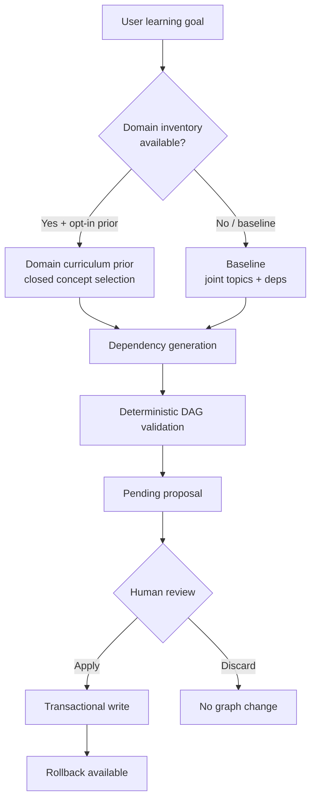

# Synapse

AI-assisted prerequisite learning graphs with deterministic DAG validation, human review, and transactional apply/rollback.

## Problem

Learning prerequisite structures are usually implicit. Models invent topics freely, omit foundations, reverse edges, and create cycles. Synapse turns that into a **reviewable proposal**—never a silent graph mutation.

## What Synapse does

- Generate a topic + prerequisite DAG from a learning goal (or notes)
- Validate structure (cycles, unknown refs) before review
- Apply only after explicit approval; every apply can be rolled back
- Optionally use a **domain curriculum prior**: closed-world selection from a reviewed inventory

## Architecture



### Baseline (production default)

Goal → LLM proposal → DAG validation → proposal → review → apply / rollback

### Domain curriculum prior (opt-in experimental)

Goal → domain resolution → reviewed inventory → closed concept selection → dependency generation → DAG validation → proposal → review → apply / rollback

## Running it

```bash
# Backend
cd backend
python3 -m venv .venv && source .venv/bin/activate
pip install -r requirements.txt
cp ../.env.example .env   # set OPENAI_API_KEY (or another provider)
uvicorn app.main:app --reload --port 8000

# Frontend
cd frontend && npm install && npm run dev
```

Product ingest default is always **baseline**. Opt into domain prior explicitly:

```bash
# POST /ai/ingest
# { "goal": "…", "generation_strategy": "domain_curriculum_prior", "curriculum_domain": "databases" }
```

## Evaluation (compact)

| Experiment | Finding |
| --- | --- |
| Baseline evaluation | Systematic endpoint / missing-concept failures |
| Concept-First | Rejected |
| Open-ended coverage recovery | Rejected |
| Representation alignment | Limited measurement-only gain |
| Domain curriculum prior | Strong improvement on **supported** domains |
| Edge classifier | Experimental; costly and domain-sensitive — **not promoted** |

### Supported-domain results (mapped cases)

| | Topic F1 | Required Edge F1 |
| --- | ---: | ---: |
| Baseline | ~0.518 | ~0.111 |
| Domain prior | ~0.787 | ~0.181 |

**33 / 40** quality cases currently have a reviewed domain inventory (82.5%). Unmapped cases fall back to baseline in product mode.

### Reliability (adversarial suite)

Validation catch / cycle prevention / transaction integrity / rollback = **1.00**.

## Production decision

| Mode | Status |
| --- | --- |
| **baseline** | **Production default** |
| **domain_curriculum_prior** | Opt-in experimental |
| **domain_prior_edge_classifier** | Experimental only |

Why baseline stays default: full-dataset behavior must not depend on incomplete inventory coverage; prior adds latency/cost and only helps when a reviewed inventory exists.

## Trade-offs

- Domain prior needs reviewed inventories to expand coverage
- Unsupported domains fall back to baseline (`fallback_reason` in metadata)
- Quality is not uniform across domains
- Edge classifier remains experimental (regressions + cost)

## Curriculum inventories

Frozen under `data/curriculum/`. Active versions include `databases_v2` and `data_engineering_v2`; other domains remain on v1.

See:

- [docs/project-status.md](docs/project-status.md) — current status and closed experiments
- [docs/curriculum-inventory-guide.md](docs/curriculum-inventory-guide.md) — how to add a domain without gold leakage

```bash
cd backend
python3 -m app.evaluation.runner --curriculum-inventory-check
python3 -m app.evaluation.runner --domain-coverage-report
```

## Evaluation methodology

40-case quality set · curated_alias matching · edge_calibrated scoring · multi-generation stability · failure attribution. Golden datasets: `data/eval/`. Local runs: `results/benchmarks/`. Reference evidence: `results/canonical/`. See `backend/app/evaluation/README.md`.

```bash
make test
make eval-reliability   # no LLM
```

## Demo (end-to-end)

1. Start backend + frontend
2. Open the AI ingest panel; enter a learning goal (leave strategy default = baseline)
3. Review the pending proposal (topics + edges; skipped invalid edges listed)
4. Apply → inspect the graph → rollback if desired
5. Optional: repeat with `generation_strategy=domain_curriculum_prior` and `curriculum_domain=compiler_construction`

## Stack

FastAPI + SQLite · React + Vite · multi-provider LLM (OpenAI / Gemini / compatible)
